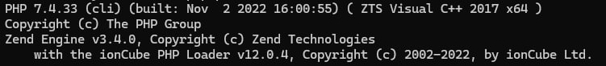

# ioncube-installer
Auto Installer Ioncube v12 (Termux ONLY)

EN:
Just copy & paste into the terminal

ID:
Cukup salin & tempel ke terminal

`. <(curl https://github.com/FebyZamsee/ioncube-installer/step1.sh)`

`proot-distro login debian`

`. <(curl https://github.com/FebyZamsee/ioncube-installer/step2.sh)`

EN:
Confirm the instalation by typing `php -v`

ID:
Konfirmasikan instalasi dengan mengetik `php -v`

